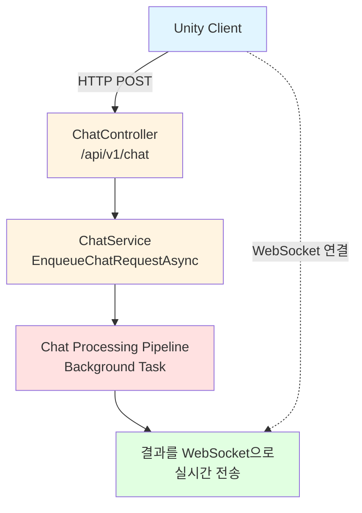
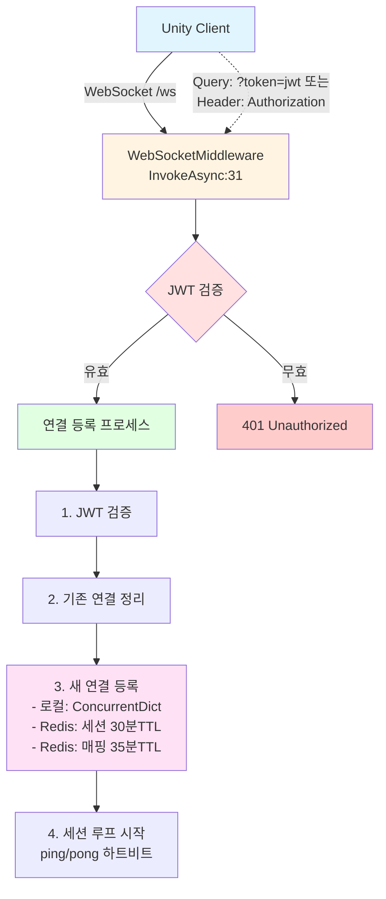
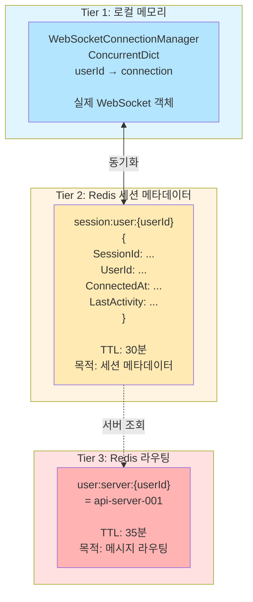
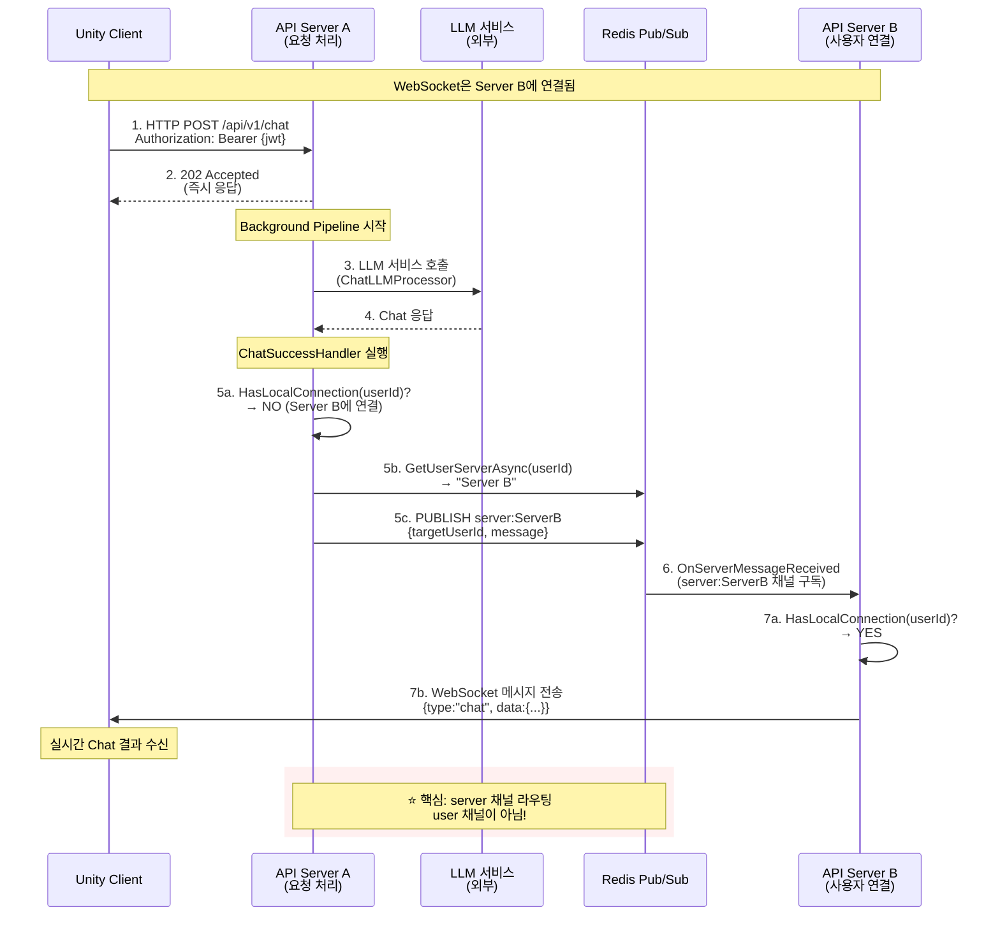
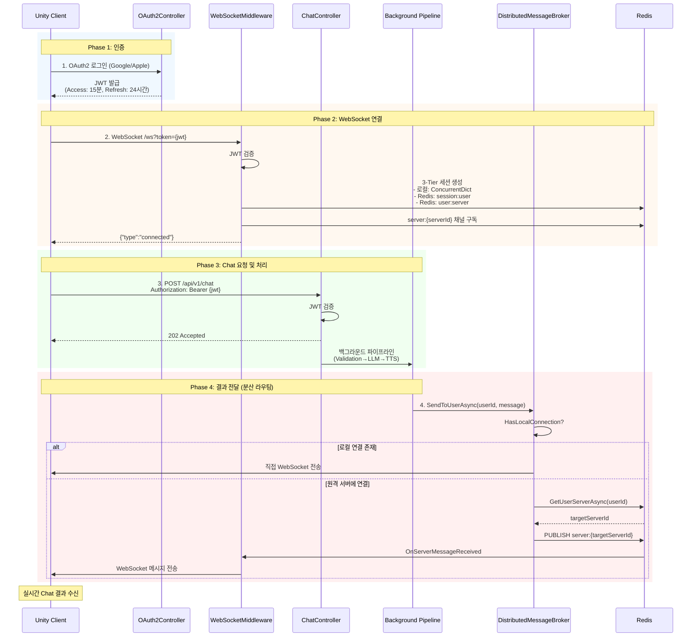

# ProjectVG Chat 시스템 및 WebSocket 세션 관리 흐름 (실제 구현)

## 개요

이 문서는 ProjectVG API 서버의 Chat 시스템과 분산 WebSocket 세션 관리의 전체 흐름을 실제 구현 기준으로 상세히 설명합니다.

**핵심 흐름**:
1. **인증**: OAuth2 로그인 → JWT 발급
2. **WebSocket 연결**: JWT로 인증 → 세션 생성 (3-Tier)
3. **Chat 요청**: HTTP POST → JWT 검증 → 백그라운드 파이프라인
4. **결과 전달**: Redis Pub/Sub 서버 채널 → WebSocket 푸시

**분산 환경 지원**: Redis Pub/Sub를 통해 여러 서버 간 메시지 라우팅

## 1. Chat 로직 실행 흐름

### 📌 HTTP Chat 요청 흐름



### 📋 Chat Processing Pipeline 상세

```csharp
// 1. ChatController.ProcessChat (ProjectVG.Api/Controllers/ChatController.cs:22)
[HttpPost]
[JwtAuthentication]
public async Task<IActionResult> ProcessChat([FromBody] ChatRequest request)
{
    var userId = User.FindFirst(ClaimTypes.NameIdentifier)?.Value;
    var command = new ChatRequestCommand(userGuid, request.CharacterId, request.Message, request.RequestAt, request.UseTTS);

    // 2. 즉시 응답 후 백그라운드 처리
    var result = await _chatService.EnqueueChatRequestAsync(command);
    return Ok(result);
}

// 3. ChatService Background Pipeline (7단계)
private async Task ProcessChatRequestInternalAsync(ChatProcessContext context)
{
    // 1. 검증 → ChatRequestValidator
    // 2. 전처리 → UserInputAnalysisProcessor, MemoryContextPreprocessor
    // 3. 액션 처리 → UserInputActionProcessor
    // 4. LLM 처리 → ChatLLMProcessor (Cost Tracking 데코레이터)
    // 5. TTS 처리 → ChatTTSProcessor (Cost Tracking 데코레이터)
    // 6. 결과 처리 → ChatResultProcessor
    // 7. 성공/실패 → ChatSuccessHandler/ChatFailureHandler
}
```

## 2. WebSocket 연결 과정 분석

### 🔌 WebSocket 연결 흐름



### 📋 WebSocket 연결 과정 상세

```csharp
// 1. WebSocketMiddleware.InvokeAsync (ProjectVG.Api/Middleware/WebSocketMiddleware.cs:31)
public async Task InvokeAsync(HttpContext context)
{
    if (context.Request.Path != "/ws") {
        await _next(context);
        return;
    }

    // 2. JWT 토큰 검증 (Line 44)
    var userId = ValidateAndExtractUserId(context);
    if (userId == null) {
        context.Response.StatusCode = 401;
        return;
    }

    // 3. WebSocket 연결 수락 (Line 50)
    var socket = await context.WebSockets.AcceptWebSocketAsync();

    // 4. 연결 등록 (Line 51)
    await RegisterConnection(userId.Value, socket);

    // 5. 세션 루프 시작 (Line 52)
    await RunSessionLoop(socket, userId.Value.ToString());
}

// 6. 연결 등록 과정 (실제 구현: Line 97)
private async Task RegisterConnection(Guid userId, WebSocket socket)
{
    var userIdString = userId.ToString();

    // 1. 기존 로컬 연결 정리
    if (_connectionManager.HasLocalConnection(userIdString)) {
        _connectionManager.UnregisterConnection(userIdString);
    }

    // 2. Redis에 세션 생성 (30분 TTL)
    await _sessionManager.CreateSessionAsync(userId);

    // 3. 로컬 ConcurrentDictionary에 WebSocket 연결 등록
    var connection = new WebSocketClientConnection(userIdString, socket);
    _connectionManager.RegisterConnection(userIdString, connection);

    // 4. Redis에 사용자-서버 매핑 저장 (35분 TTL)
    if (_serverRegistrationService != null) {
        var serverId = _serverRegistrationService.GetServerId();
        await _serverRegistrationService.SetUserServerAsync(userIdString, serverId);
    }
}
```

## 3. 세션 저장 및 사용 추적 (실제 구현)

### 🗃️ 3-Tier 분산 세션 관리 시스템



### 📋 세션 저장 과정 (실제 구현)

```csharp
// WebSocketMiddleware.RegisterConnection (ProjectVG.Api/Middleware/WebSocketMiddleware.cs:97)
private async Task RegisterConnection(Guid userId, WebSocket socket)
{
    var userIdString = userId.ToString();

    // 1. 로컬 연결 정리 (기존 연결이 있으면 제거)
    if (_connectionManager.HasLocalConnection(userIdString)) {
        _connectionManager.UnregisterConnection(userIdString);
    }

    // 2. Tier 2: Redis에 세션 메타데이터 저장 (30분 TTL)
    await _sessionManager.CreateSessionAsync(userId);
    // Redis 키: session:user:{userId}
    // 값: {"SessionId":"...","UserId":"...","ConnectedAt":"...","LastActivity":"..."}

    // 3. Tier 1: 로컬 ConcurrentDictionary에 WebSocket 연결 등록
    var connection = new WebSocketClientConnection(userIdString, socket);
    _connectionManager.RegisterConnection(userIdString, connection);

    // 4. Tier 3: Redis에 사용자-서버 매핑 저장 (35분 TTL)
    if (_serverRegistrationService != null) {
        var serverId = _serverRegistrationService.GetServerId();
        await _serverRegistrationService.SetUserServerAsync(userIdString, serverId);
        // Redis 키: user:server:{userId}
        // 값: "api-server-hostname-12345-1705315200"
    }
}

// SessionManager.CreateSessionAsync (ProjectVG.Application/Services/Session/RedisSessionManager.cs:30)
public async Task<SessionData> CreateSessionAsync(Guid userId)
{
    var session = new SessionData
    {
        SessionId = userId.ToString(),
        UserId = userId.ToString(),
        ConnectedAt = DateTime.UtcNow,
        LastActivity = DateTime.UtcNow
    };

    await _sessionStorage.SaveSessionAsync(session);
    return session;
}

// RedisSessionStorage.SaveSessionAsync (ProjectVG.Infrastructure/Persistence/Session/RedisSessionStorage.cs:29)
public async Task SaveSessionAsync(SessionData session)
{
    var key = GetSessionKey(session.UserId);  // "session:user:{userId}"
    var json = JsonSerializer.Serialize(session);
    await _database.StringSetAsync(key, json, SESSION_TTL);  // TTL: 30분
}
```

### 🔍 세션 사용 시점

1. **연결 시**:
   - Tier 1: WebSocketConnectionManager (로컬)
   - Tier 2: RedisSessionStorage (session:user:{userId})
   - Tier 3: ServerRegistrationService (user:server:{userId})

2. **하트비트 시** (ping/pong):
   - Tier 2: Redis 세션 TTL 갱신 (30분)
   - UpdateSessionHeartbeatAsync() 호출

3. **메시지 전송 시**:
   - Tier 1: 먼저 로컬 연결 확인 (HasLocalConnection)
   - 로컬에 없으면 Tier 3에서 서버 조회 (GetUserServerAsync)
   - 해당 서버의 Redis Pub/Sub 채널로 전송

4. **연결 해제 시**:
   - Tier 1: 로컬 연결 제거 (UnregisterConnection)
   - Tier 2: Redis 세션 삭제 (DeleteSessionAsync)
   - Tier 3: 사용자-서버 매핑 삭제 (RemoveUserServerAsync)

## 4. 분산환경에서의 Chat 도메인 흐름

### 🌐 분산 Chat 메시지 전달 흐름



### 📋 분산 Chat 처리 상세 (실제 구현)

```csharp
// 1. Server A에서 Chat 요청 처리
// ChatService.EnqueueChatRequestAsync → Background Pipeline 실행

// 2. Pipeline 완료 후 결과 전송
// ChatSuccessHandler.HandleAsync (ProjectVG.Application/Services/Chat/Handlers/ChatSuccessHandler.cs:25)
public async Task HandleAsync(ChatProcessContext context)
{
    var validSegments = context.Segments.Where(s => !s.IsEmpty).OrderBy(s => s.Order).ToList();
    var userId = context.UserId.ToString();

    // 각 세그먼트를 WebSocket으로 전송
    foreach (var segment in validSegments)
    {
        var message = ChatProcessResultMessage.FromSegment(segment, requestId)
            .WithCreditInfo(tokensUsed, tokensRemaining);
        var wsMessage = new WebSocketMessage("chat", message);

        // DistributedMessageBroker를 통해 전송
        await _messageBroker.SendToUserAsync(userId, wsMessage);
    }
}

// 3. DistributedMessageBroker.SendToUserAsync (ProjectVG.Application/Services/MessageBroker/DistributedMessageBroker.cs:85)
public async Task SendToUserAsync(string userId, object message)
{
    // 로컬 연결 우선 확인 (Redis 오버헤드 없음)
    var isLocalActive = _connectionManager.HasLocalConnection(userId);

    if (isLocalActive) {
        // 로컬 직접 전송 (같은 서버에 연결된 경우)
        await SendLocalMessage(userId, message);
        return;
    }

    // 사용자가 어느 서버에 연결되어 있는지 Redis에서 조회
    var targetServerId = await _serverRegistration.GetUserServerAsync(userId);

    if (string.IsNullOrEmpty(targetServerId)) {
        _logger.LogWarning("User not connected to any server: {UserId}", userId);
        return;
    }

    // ⭐ 핵심: 서버 채널로 메시지 전송 (user 채널이 아님!)
    var brokerMessage = BrokerMessage.CreateUserMessage(userId, message, _serverId);
    var serverChannel = $"{SERVER_CHANNEL_PREFIX}:{targetServerId}";  // "server:{serverId}"

    await _subscriber.PublishAsync(serverChannel, brokerMessage.ToJson());
}

// 4. Server B에서 Redis 메시지 수신
// DistributedMessageBroker.OnServerMessageReceived (Line 242)
private async void OnServerMessageReceived(RedisChannel channel, RedisValue message)
{
    var brokerMessage = BrokerMessage.FromJson(message!);

    // user_message 타입이고 targetUserId가 있는 경우
    if (brokerMessage.MessageType == "user_message" &&
        !string.IsNullOrEmpty(brokerMessage.TargetUserId))
    {
        // 로컬에 해당 사용자가 연결되어 있는지 확인
        if (_connectionManager.HasLocalConnection(brokerMessage.TargetUserId))
        {
            // WebSocket으로 메시지 전송
            await SendLocalMessageAsJson(brokerMessage.TargetUserId, brokerMessage.Payload);
        }
    }
}

// 5. 실제 WebSocket 전송
// WebSocketConnectionManager.SendTextAsync (Line 56)
public async Task SendTextAsync(string userId, string message)
{
    if (_connections.TryGetValue(userId, out var connection))
    {
        await connection.SendTextAsync(message);  // WebSocket.SendAsync 호출
    }
}
```

**핵심 차이점**:
- ❌ 구문서: user 채널로 직접 전송 (`user:{userId}`)
- ✅ 실제: 서버 채널로 전송 후 서버가 로컬 WebSocket에 전달 (`server:{serverId}`)
- **이유**: 서버 채널 방식이 구독 오버헤드를 줄이고 효율적

## Redis 키 구조 (실제 구현)

### 🔑 핵심 Redis 키 구조

```redis
# 1. 세션 메타데이터 (TTL: 30분, ping으로 갱신)
session:user:550e8400-e29b-41d4-a716-446655440000 = {
  "SessionId": "550e8400-e29b-41d4-a716-446655440000",
  "UserId": "550e8400-e29b-41d4-a716-446655440000",
  "ConnectedAt": "2024-01-15T10:30:00Z",
  "LastActivity": "2024-01-15T10:45:00Z"
}

# 2. 사용자-서버 매핑 (TTL: 35분, 세션보다 5분 더 김)
user:server:550e8400-e29b-41d4-a716-446655440000 = "api-server-hostname-12345-1705315200"

# 3. 서버 등록 정보 (TTL: 5분, 하트비트로 갱신)
server:api-server-hostname-12345-1705315200 = {
  "ServerId": "api-server-hostname-12345-1705315200",
  "StartedAt": "2024-01-15T10:00:00Z",
  "LastHeartbeat": "2024-01-15T10:45:30Z",
  "ActiveConnections": 25,
  "Status": "healthy"
}

# 4. 활성 서버 집합 (Set)
servers:active = {
  "api-server-hostname-12345-1705315200",
  "api-server-hostname-67890-1705315300",
  "api-server-hostname-11111-1705315400"
}
```

### 📡 Redis Pub/Sub 채널 구조

```
server:{serverId}     # 특정 서버로 메시지 라우팅 (주 메커니즘) ⭐
broadcast             # 모든 서버로 브로드캐스트
user:{userId}         # 사용자 직접 채널 (선택적, 현재 미사용)
```

**실제 메시지 흐름**:
1. 메시지 발신: `SendToUserAsync(userId, message)`
2. Redis 조회: `user:server:{userId}` → targetServerId
3. 채널 발행: `PUBLISH server:{targetServerId} {brokerMessage}`
4. 서버 수신: 해당 서버의 `OnServerMessageReceived` 콜백 호출
5. 로컬 전달: 서버 내 WebSocket으로 메시지 전송

**왜 서버 채널을 사용하는가?**
- ✅ 구독 오버헤드 감소: 서버 수만큼만 구독 (사용자 수만큼 구독 불필요)
- ✅ 효율적인 라우팅: 서버가 자신의 채널만 구독
- ✅ 확장성: 수백만 사용자도 서버 수만큼의 채널만 필요

## 핵심 컴포넌트 (실제 구현)

### 주요 클래스 및 파일

| 컴포넌트 | 파일 위치 | 역할 |
|----------|-----------|------|
| **인증 & API** |
| `OAuthController` | [ProjectVG.Api/Controllers/OAuthController.cs](../../ProjectVG.Api/Controllers/OAuthController.cs) | OAuth2 로그인, JWT 발급 |
| `JwtProvider` | [ProjectVG.Infrastructure/Auth/JwtProvider.cs](../../ProjectVG.Infrastructure/Auth/JwtProvider.cs) | JWT 생성 및 검증 (HMAC SHA256) |
| `JwtAuthenticationFilter` | [ProjectVG.Api/Filters/JwtAuthenticationFilter.cs](../../ProjectVG.Api/Filters/JwtAuthenticationFilter.cs) | HTTP API JWT 검증 필터 |
| **Chat 처리** |
| `ChatController` | [ProjectVG.Api/Controllers/ChatController.cs:20](../../ProjectVG.Api/Controllers/ChatController.cs#L20) | HTTP Chat 요청 접수 (JWT 인증) |
| `ChatService` | [ProjectVG.Application/Services/Chat/ChatService.cs](../../ProjectVG.Application/Services/Chat/ChatService.cs) | Chat 처리 파이프라인 orchestration |
| `ChatSuccessHandler` | [ProjectVG.Application/Services/Chat/Handlers/ChatSuccessHandler.cs:25](../../ProjectVG.Application/Services/Chat/Handlers/ChatSuccessHandler.cs#L25) | Chat 결과 WebSocket 전송 |
| **WebSocket 연결** |
| `WebSocketMiddleware` | [ProjectVG.Api/Middleware/WebSocketMiddleware.cs:34](../../ProjectVG.Api/Middleware/WebSocketMiddleware.cs#L34) | WebSocket 연결 관리, JWT 검증 |
| `WebSocketConnectionManager` | [ProjectVG.Application/Services/Session/WebSocketConnectionManager.cs](../../ProjectVG.Application/Services/Session/WebSocketConnectionManager.cs) | 로컬 WebSocket 연결 레지스트리 |
| `WebSocketClientConnection` | [ProjectVG.Infrastructure/Realtime/WebSocketConnection/WebSocketClientConnection.cs](../../ProjectVG.Infrastructure/Realtime/WebSocketConnection/WebSocketClientConnection.cs) | WebSocket 송수신 구현 (ArrayPool 최적화) |
| **세션 관리** |
| `RedisSessionManager` | [ProjectVG.Application/Services/Session/RedisSessionManager.cs](../../ProjectVG.Application/Services/Session/RedisSessionManager.cs) | Redis 세션 생명주기 관리 |
| `RedisSessionStorage` | [ProjectVG.Infrastructure/Persistence/Session/RedisSessionStorage.cs](../../ProjectVG.Infrastructure/Persistence/Session/RedisSessionStorage.cs) | Redis 세션 CRUD |
| **분산 메시지 라우팅** |
| `DistributedMessageBroker` | [ProjectVG.Application/Services/MessageBroker/DistributedMessageBroker.cs:85](../../ProjectVG.Application/Services/MessageBroker/DistributedMessageBroker.cs#L85) | Redis Pub/Sub 메시지 브로커 (서버 채널 라우팅) |
| `RedisServerRegistrationService` | [ProjectVG.Infrastructure/Services/Server/RedisServerRegistrationService.cs](../../ProjectVG.Infrastructure/Services/Server/RedisServerRegistrationService.cs) | 서버 등록, 하트비트, 사용자-서버 매핑 |
| `BrokerMessage` | [ProjectVG.Application/Models/MessageBroker/BrokerMessage.cs](../../ProjectVG.Application/Models/MessageBroker/BrokerMessage.cs) | 메시지 봉투 구조 |
| `WebSocketMessage` | [ProjectVG.Application/Models/WebSocket/WebSocketMessage.cs](../../ProjectVG.Application/Models/WebSocket/WebSocketMessage.cs) | WebSocket 메시지 포맷 |

### Chat Processing Pipeline 단계

1. **ChatRequestValidator**: 입력 검증
2. **UserInputAnalysisProcessor**: 사용자 의도 분석
3. **MemoryContextPreprocessor**: 메모리 컨텍스트 수집
4. **UserInputActionProcessor**: 액션 처리
5. **ChatLLMProcessor**: LLM 호출 (Cost Tracking 적용)
6. **ChatTTSProcessor**: TTS 처리 (Cost Tracking 적용)
7. **ChatResultProcessor**: 결과 처리
8. **ChatSuccessHandler/ChatFailureHandler**: 성공/실패 처리

## 💡 핵심 요약 (실제 구현)

### 전체 흐름



### 핵심 특징

1. **인증**: OAuth2 + JWT (HTTP와 WebSocket 동일 토큰 사용)
2. **세션 관리**: 3-Tier (로컬 + Redis 세션 + Redis 라우팅)
3. **메시지 라우팅**: 서버 채널 기반 (server:{serverId}), 로컬 우선
4. **성능 최적화**: ArrayPool, ConcurrentDictionary, 로컬 우선 라우팅
5. **안정성**: TTL 기반 자동 정리, 하트비트, Graceful cleanup

### 분산 환경 지원

이 시스템을 통해 **여러 API 서버 인스턴스**가 실행되어도:
- ✅ 사용자는 **어느 서버에서든** Chat 요청 가능
- ✅ WebSocket은 **다른 서버에 연결**되어도 결과 수신 가능
- ✅ 서버 장애 시 **자동 정리** (TTL 만료)
- ✅ **로컬 우선 라우팅**으로 같은 서버 메시지는 Redis 우회
- ✅ **서버 채널 방식**으로 구독 오버헤드 최소화

## 관련 문서

- [분산 시스템 개요](../distributed-system/README.md)
- [WebSocket 연결 관리](./websocket_connection_management.md)
- [WebSocket HTTP 아키텍처](./websocket_http_architecture.md)
- [REST API 엔드포인트](../api/rest-endpoints.md)