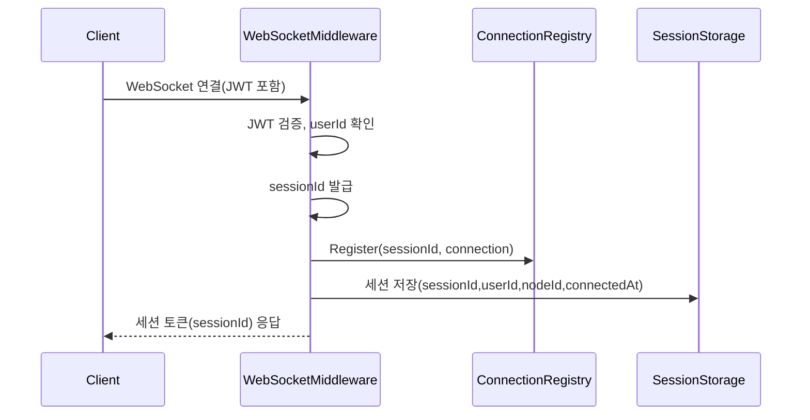
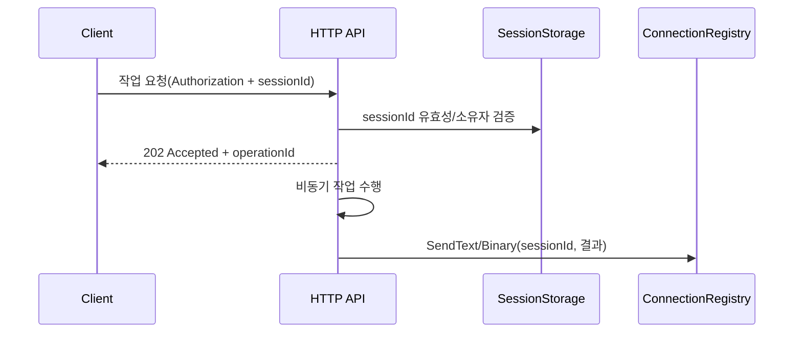

## WebSocket 연결 관리 설계

### 목표/범위
- WebSocket 연결을 노드 로컬에서 안전하게 관리하고, HTTP 요청과 결합해 비동기 결과를 WebSocket으로 푸시하는 구조를 정의한다.
- 연결 핸들(소켓)은 로컬, 세션 메타데이터는 공유 스토리지로 분리한다.

### 사전 질문에 대한 답변
- WebSocket Connection 저장 위치
  - 노드 로컬 인메모리 맵(`sessionId -> IClientConnection`)이 일반적이다. 소켓 핸들은 직렬화/외부 저장이 불가하다.
  - 공유 스토어(예: Redis)에는 메타데이터만 저장한다(`sessionId/userId/nodeId/lastSeen/rooms...`).
- WebSocket Connection과 세션의 관계
  - 별개 개념이다. Connection은 런타임 전송 객체, 세션은 공유/조회 가능한 논리 상태이다. 1:N(멀티탭·디바이스)도 고려 가능하다.

### 컴포넌트 설계
- Connection Registry(런타임)
  - 책임: 연결 등록/해제, 조회, 전송(텍스트/바이너리), 사용자별 인덱스, 브로드캐스트 헬퍼
  - 내부 자료구조: `ConcurrentDictionary<string, IClientConnection>`와 `ConcurrentDictionary<string, HashSet<string>>`(userId → sessionIds)
  - 최소 인터페이스 예시:
```csharp
public interface IConnectionRegistry
{
    /// <summary>
    /// 연결을 등록합니다
    /// </summary>
    void Register(string sessionId, IClientConnection connection);

    /// <summary>
    /// 연결을 해제합니다
    /// </summary>
    void Unregister(string sessionId);

    /// <summary>
    /// 연결을 조회합니다
    /// </summary>
    bool TryGet(string sessionId, out IClientConnection? connection);

    /// <summary>
    /// 사용자 ID로 세션 목록을 조회합니다
    /// </summary>
    IEnumerable<string> GetSessionIdsByUserId(string userId);

    /// <summary>
    /// 텍스트/바이너리를 전송합니다
    /// </summary>
    Task SendTextAsync(string sessionId, string message);
    Task SendBinaryAsync(string sessionId, byte[] data);
}
```

- Session Storage(공유)
  - 책임: 세션 메타데이터의 단일 근원지. `sessionId/userId/nodeId/connectedAt/lastSeen/presence` 등 저장.
  - 구현: `ISessionStorage` 인터페이스, `InMemorySessionStorage`, `RedisSessionStorage`(향후).

- WebSocketMiddleware(얇은 어댑터)
  - API 레이어에 위치. 핸드셰이크/인증/JWT 검증, 세션 토큰 발급, Registry 등록/해제, Storage 반영.
  - 비즈니스/전송 로직은 `IConnectionRegistry`, `ISessionService`에 위임.

- Message Producer/Broker(서비스들)
  - 도메인 작업 완료 시 `IConnectionRegistry`를 통해 대상 세션으로 푸시한다.

### 시퀀스
#### 연결 수립


#### HTTP 요청 수락 → WS 푸시


#### 재연결/해제
- 재연결: 클라이언트는 기존 `sessionId`로 재연결 요청. 소유자 검증 후 기존 연결을 교체하고 `lastSeen` 갱신.
- 해제: 연결 종료 이벤트에서 `Unregister` 및 Storage 정리(TTL/lastSeen 기반 만료).

### 운영/확장 고려
- nodeId 매핑과 백플레인(pub/sub)로 노드 간 라우팅/브로드캐스트 지원.
- Ping/Pong 하트비트, 유휴 타임아웃, 압축/버퍼 최적화.
- 관찰성: traceId/correlationId 전파, 활성 연결/전송량/지연/재연결율 메트릭.

### 보안
- 세션 토큰은 사용자 토큰과 바인딩하고 만료/회수 가능해야 한다.
- HTTP 요청의 `sessionId`는 소유자/존재/노드 유효성 검증을 거친다.

### 결정 사항 요약
- HTTP 수락 + WebSocket 푸시 구조를 유지한다.
- 연결 관리는 `IConnectionRegistry`(노드 로컬), 세션 메타데이터는 `ISessionStorage`(공유)로 분리한다.
- WebSocketMiddleware는 API 레이어에 두되, 로직은 `Application` 서비스로 위임한다.

### 단계적 적용 계획(스켈레톤 우선)
1. `IConnectionRegistry` 인터페이스 추가 및 기본 구현(인메모리) 스켈레톤 작성.
2. `WebSocketMiddleware`에서 Registry 주입/호출로 등록/해제만 연결.
3. `ISessionStorage`에 `nodeId/lastSeen` 반영(필드 확장은 별도 PR).
4. 도메인 서비스에서 결과 푸시 시 `IConnectionRegistry` 사용하도록 의존성 교체.


