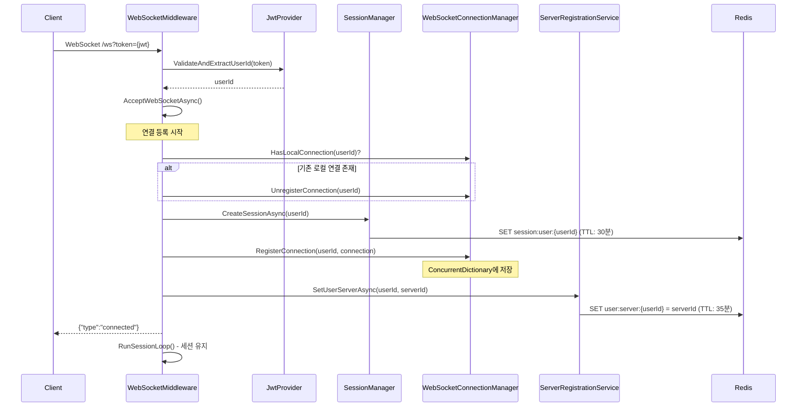
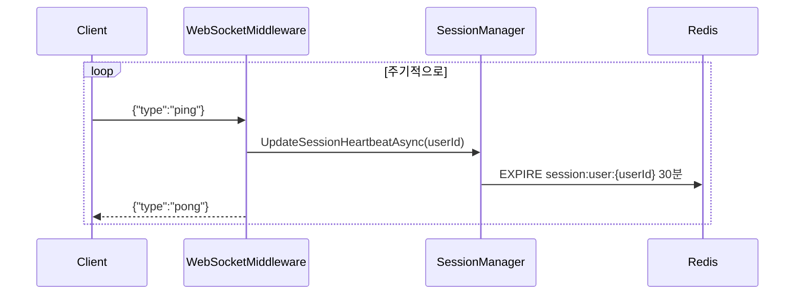
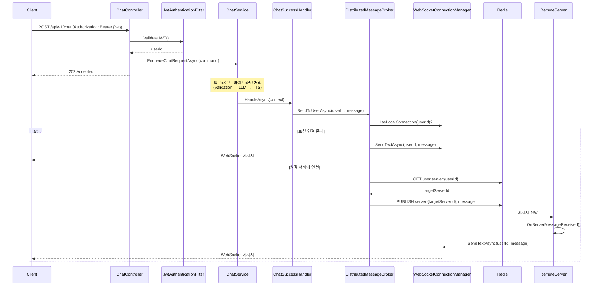
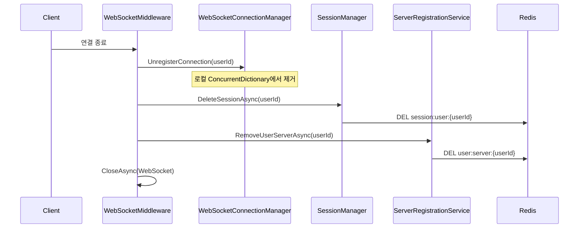

## WebSocket 연결 관리 설계

### 목표/범위
- WebSocket 연결을 노드 로컬에서 안전하게 관리하고, HTTP 요청과 결합해 비동기 결과를 WebSocket으로 푸시하는 구조를 정의한다.
- 연결 핸들(소켓)은 로컬, 세션 메타데이터는 공유 스토리지로 분리한다.
- HTTP OAuth2에서 발급된 JWT를 WebSocket 연결 시 사용하여 인증하고 세션을 생성한다.

### 사전 질문에 대한 답변
- WebSocket Connection 저장 위치
  - 노드 로컬 인메모리 맵(`userId -> IClientConnection`)이 일반적이다. 소켓 핸들은 직렬화/외부 저장이 불가하다.
  - 공유 스토어(Redis)에는 **세 가지 유형의 데이터**를 저장한다:
    1. **세션 메타데이터**: `session:user:{userId}` (TTL: 30분)
    2. **사용자-서버 매핑**: `user:server:{userId}` → serverId (TTL: 35분)
    3. **서버 등록 정보**: `server:{serverId}` (TTL: 5분, 하트비트로 갱신)
- WebSocket Connection과 세션의 관계
  - 별개 개념이다. Connection은 런타임 전송 객체, 세션은 공유/조회 가능한 논리 상태이다.
  - **현재 구현**: 1 사용자 당 1 WebSocket 연결 (신규 연결 시 기존 연결 종료)

### 컴포넌트 설계

#### 1. WebSocketConnectionManager (로컬 연결 관리)
- **위치**: [ProjectVG.Application/Services/Session/WebSocketConnectionManager.cs](../../../ProjectVG.Application/Services/Session/WebSocketConnectionManager.cs)
- **책임**: 현재 서버의 WebSocket 연결 등록/해제, 조회, 전송(텍스트/바이너리)
- **내부 자료구조**: `ConcurrentDictionary<string, IClientConnection>` (userId → connection)
- **인터페이스**:
```csharp
public interface IWebSocketConnectionManager
{
    void RegisterConnection(string userId, IClientConnection connection);
    void UnregisterConnection(string userId);
    bool HasLocalConnection(string userId);
    IEnumerable<string> GetLocalConnectedSessionIds();
    Task SendTextAsync(string userId, string message);
    Task SendBinaryAsync(string userId, byte[] data);
}
```

#### 2. SessionManager (세션 생명주기 관리)
- **위치**: [ProjectVG.Application/Services/Session/RedisSessionManager.cs](../../../ProjectVG.Application/Services/Session/RedisSessionManager.cs)
- **책임**: Redis 기반 세션 메타데이터 CRUD, 하트비트 갱신
- **Redis 키**: `session:user:{userId}`
- **TTL**: 30분 (하트비트로 갱신)
- **인터페이스**:
```csharp
public interface ISessionManager
{
    Task<SessionData> CreateSessionAsync(Guid userId);
    Task<SessionData?> GetSessionAsync(Guid userId);
    Task UpdateSessionHeartbeatAsync(Guid userId);
    Task DeleteSessionAsync(Guid userId);
    Task<bool> IsSessionActiveAsync(Guid userId);
}
```

#### 3. RedisSessionStorage (세션 데이터 영속성)
- **위치**: [ProjectVG.Infrastructure/Persistence/Session/RedisSessionStorage.cs](../../../ProjectVG.Infrastructure/Persistence/Session/RedisSessionStorage.cs)
- **책임**: Redis에 세션 데이터 저장/조회/삭제
- **데이터 구조**:
```json
{
  "SessionId": "user-guid",
  "UserId": "user-guid",
  "ConnectedAt": "2024-01-15T10:30:00Z",
  "LastActivity": "2024-01-15T10:45:00Z"
}
```

#### 4. ServerRegistrationService (서버 등록 및 라우팅)
- **위치**: [ProjectVG.Infrastructure/Services/Server/RedisServerRegistrationService.cs](../../../ProjectVG.Infrastructure/Services/Server/RedisServerRegistrationService.cs)
- **책임**:
  - 서버 등록 및 하트비트
  - 사용자-서버 매핑 관리 (`user:server:{userId}` → serverId)
  - 서버 간 메시지 라우팅을 위한 디스커버리
- **Redis 키**:
  - `server:{serverId}`: 서버 정보 (TTL: 5분)
  - `user:server:{userId}`: 사용자가 연결된 서버 ID (TTL: 35분)
  - `servers:active`: 활성 서버 집합

#### 5. WebSocketMiddleware (연결 엔드포인트)
- **위치**: [ProjectVG.Api/Middleware/WebSocketMiddleware.cs](../../../ProjectVG.Api/Middleware/WebSocketMiddleware.cs)
- **책임**:
  - WebSocket 핸드셰이크 처리 (`/ws` 엔드포인트)
  - JWT 검증 (쿼리 파라미터 또는 Authorization 헤더)
  - 연결 등록 및 세션 생성
  - 세션 루프 관리 (ping/pong, 메시지 수신)
  - 연결 종료 시 정리
- **JWT 추출**:
  1. 쿼리 파라미터: `/ws?token={jwt}`
  2. Authorization 헤더: `Authorization: Bearer {jwt}`

#### 6. WebSocketClientConnection (WebSocket 송수신 구현)
- **위치**: [ProjectVG.Infrastructure/Realtime/WebSocketConnection/WebSocketClientConnection.cs](../../../ProjectVG.Infrastructure/Realtime/WebSocketConnection/WebSocketClientConnection.cs)
- **책임**: 실제 WebSocket 프로토콜 송수신
- **최적화**: `ArrayPool<byte>.Shared` 사용으로 LOH 할당 방지

#### 7. DistributedMessageBroker (분산 메시지 라우팅)
- **위치**: [ProjectVG.Application/Services/MessageBroker/DistributedMessageBroker.cs](../../../ProjectVG.Application/Services/MessageBroker/DistributedMessageBroker.cs)
- **책임**:
  - 로컬 연결 우선 전송
  - 원격 사용자의 경우 Redis Pub/Sub로 라우팅
  - 서버 채널 구독 및 메시지 수신
- **Redis Pub/Sub 채널**:
  - `server:{serverId}`: 서버별 메시지
  - `broadcast`: 전체 서버 브로드캐스트
  - `user:{userId}`: 사용자별 직접 채널 (선택적)

### 시퀀스

#### 연결 수립 (실제 구현)

```mermaid
sequenceDiagram
  participant Client
  participant MW as WebSocketMiddleware
  participant JWT as JwtProvider
  participant SM as SessionManager
  participant Reg as WebSocketConnectionManager
  participant SRV as ServerRegistrationService
  participant Redis

  Client->>MW: WebSocket /ws?token={jwt}
  MW->>JWT: ValidateAndExtractUserId(token)
  JWT-->>MW: userId
  MW->>MW: AcceptWebSocketAsync()

  Note over MW: 연결 등록 시작
  MW->>Reg: HasLocalConnection(userId)?
  alt 기존 로컬 연결 존재
    MW->>Reg: UnregisterConnection(userId)
  end

  MW->>SM: CreateSessionAsync(userId)
  SM->>Redis: SET session:user:{userId} (TTL: 30분)

  MW->>Reg: RegisterConnection(userId, connection)
  Note over Reg: ConcurrentDictionary에 저장

  MW->>SRV: SetUserServerAsync(userId, serverId)
  SRV->>Redis: SET user:server:{userId} = serverId (TTL: 35분)

  MW-->>Client: {"type":"connected"}
  MW->>MW: RunSessionLoop() - 세션 유지
```

#### Ping/Pong 하트비트

```mermaid
sequenceDiagram
  participant Client
  participant MW as WebSocketMiddleware
  participant SM as SessionManager
  participant Redis

  loop 주기적으로
    Client->>MW: {"type":"ping"}
    MW->>SM: UpdateSessionHeartbeatAsync(userId)
    SM->>Redis: EXPIRE session:user:{userId} 30분
    MW-->>Client: {"type":"pong"}
  end
```

#### HTTP 요청 → 백그라운드 처리 → WebSocket 푸시

```mermaid
sequenceDiagram
  participant Client
  participant API as ChatController
  participant JWT as JwtAuthenticationFilter
  participant CS as ChatService
  participant Handler as ChatSuccessHandler
  participant MB as DistributedMessageBroker
  participant Reg as WebSocketConnectionManager
  participant Redis
  participant RemoteServer

  Client->>API: POST /api/v1/chat (Authorization: Bearer {jwt})
  API->>JWT: ValidateJWT()
  JWT-->>API: userId
  API->>CS: EnqueueChatRequestAsync(command)
  API-->>Client: 202 Accepted

  Note over CS: 백그라운드 파이프라인 처리<br/>(Validation → LLM → TTS)

  CS->>Handler: HandleAsync(context)
  Handler->>MB: SendToUserAsync(userId, message)

  MB->>Reg: HasLocalConnection(userId)?
  alt 로컬 연결 존재
    MB->>Reg: SendTextAsync(userId, message)
    Reg-->>Client: WebSocket 메시지
  else 원격 서버에 연결
    MB->>Redis: GET user:server:{userId}
    Redis-->>MB: targetServerId
    MB->>Redis: PUBLISH server:{targetServerId}, message
    Redis-->>RemoteServer: 메시지 전달
    RemoteServer->>RemoteServer: OnServerMessageReceived()
    RemoteServer->>Reg: SendTextAsync(userId, message)
    Reg-->>Client: WebSocket 메시지
  end
```

#### 연결 해제 및 정리

```mermaid
sequenceDiagram
  participant Client
  participant MW as WebSocketMiddleware
  participant Reg as WebSocketConnectionManager
  participant SM as SessionManager
  participant SRV as ServerRegistrationService
  participant Redis

  Client->>MW: 연결 종료
  MW->>Reg: UnregisterConnection(userId)
  Note over Reg: 로컬 ConcurrentDictionary에서 제거

  MW->>SM: DeleteSessionAsync(userId)
  SM->>Redis: DEL session:user:{userId}

  MW->>SRV: RemoveUserServerAsync(userId)
  SRV->>Redis: DEL user:server:{userId}

  MW->>MW: CloseAsync(WebSocket)
```

### 운영/확장 고려

#### 1. 서버 간 라우팅 (구현 완료)
- **ServerRegistrationService**:
  - 서버 ID 자동 생성: `api-server-{hostname}-{pid}-{timestamp}` 또는 환경변수 `SERVER_ID`
  - 5분 TTL로 서버 등록, 하트비트로 갱신
  - 활성 서버 집합 관리 (`servers:active`)
- **DistributedMessageBroker**:
  - 로컬 연결 우선 (Redis 오버헤드 없음)
  - Redis Pub/Sub 채널: `server:{serverId}`, `broadcast`, `user:{userId}`
  - 서버 채널 기반 라우팅으로 구독 오버헤드 최소화

#### 2. 성능 최적화 (구현 완료)
- **ArrayPool 사용**: WebSocketClientConnection에서 `ArrayPool<byte>.Shared`로 LOH 할당 방지
- **ConcurrentDictionary**: 락 없는 스레드 안전 연결 저장소
- **로컬 우선 라우팅**: 같은 서버 메시지는 Redis 우회
- **서버 채널 라우팅**: 사용자별 채널 대신 서버 채널로 구독 수 감소

#### 3. 안정성 및 장애 처리
- **TTL 기반 자동 정리**:
  - 세션: 30분 (하트비트로 갱신)
  - 사용자-서버 매핑: 35분 (세션보다 5분 더 길게)
  - 서버 등록: 5분 (하트비트로 갱신, 장애 서버 자동 제거)
- **연결 타임아웃**: 30분 유휴 시 자동 종료
- **Graceful Cleanup**: Finally 블록에서 모든 리소스 정리 (Redis, 로컬 연결, WebSocket)

#### 4. 관찰성 (향후 개선)
- 활성 연결 수, 메시지 전송량, 지연 시간 메트릭
- TraceId/CorrelationId 전파
- 재연결율, 에러율 모니터링

### 보안

#### 1. JWT 기반 인증 (구현 완료)
- **HTTP Layer**: `JwtAuthenticationFilter`로 REST API 요청 검증
- **WebSocket Layer**: `WebSocketMiddleware`에서 연결 시 JWT 검증
- **동일한 JWT 토큰**: OAuth2 로그인으로 발급받은 JWT를 HTTP와 WebSocket 모두에서 사용
- **검증 알고리즘**: HMAC SHA256
- **만료 시간**: Access Token 15분, Refresh Token 24시간

#### 2. 세션 보안
- JWT에서 추출한 userId로 세션 생성 (변조 불가)
- 세션 데이터는 Redis에 저장, TTL로 자동 만료
- 신규 연결 시 기존 연결 자동 종료 (동시 접속 제한)

#### 3. Redis 키 네임스페이스 분리
- `session:user:{userId}`: 세션 데이터
- `user:server:{userId}`: 라우팅 정보
- `server:{serverId}`: 서버 등록 정보

### 결정 사항 요약

#### 아키텍처 결정
1. **HTTP 수락 + WebSocket 푸시**: REST API로 요청 수락 (202 Accepted), WebSocket으로 결과 전송
2. **3-Tier 세션 관리**:
   - 로컬: `WebSocketConnectionManager` (ConcurrentDictionary)
   - Redis 세션: `SessionManager` (session:user:{userId})
   - Redis 라우팅: `ServerRegistrationService` (user:server:{userId})
3. **분산 메시지 라우팅**: Redis Pub/Sub 서버 채널 기반 라우팅
4. **로컬 우선 최적화**: 같은 서버 메시지는 Redis 우회

#### 기술 스택
- **언어/프레임워크**: C# .NET 8.0, ASP.NET Core
- **WebSocket**: System.Net.WebSockets
- **인증**: JWT (JwtProvider with HMAC SHA256)
- **분산 저장소**: Redis (StackExchange.Redis)
- **메시지 브로커**: Redis Pub/Sub

#### 핵심 클래스 매핑
| 역할 | 인터페이스 | 구현 클래스 | 위치 |
|------|-----------|-----------|------|
| 로컬 연결 관리 | IWebSocketConnectionManager | WebSocketConnectionManager | Application/Services/Session |
| 세션 생명주기 | ISessionManager | RedisSessionManager | Application/Services/Session |
| 세션 저장소 | ISessionStorage | RedisSessionStorage | Infrastructure/Persistence/Session |
| 서버 등록 | IServerRegistrationService | RedisServerRegistrationService | Infrastructure/Services/Server |
| 메시지 라우팅 | IMessageBroker | DistributedMessageBroker | Application/Services/MessageBroker |
| WebSocket 엔드포인트 | - | WebSocketMiddleware | Api/Middleware |
| JWT 검증 | IJwtProvider | JwtProvider | Infrastructure/Auth |

### Redis 키 구조 요약

```redis
# 세션 메타데이터 (TTL: 30분)
session:user:550e8400-e29b-41d4-a716-446655440000
Value: {"SessionId":"...","UserId":"...","ConnectedAt":"...","LastActivity":"..."}

# 사용자-서버 매핑 (TTL: 35분)
user:server:550e8400-e29b-41d4-a716-446655440000
Value: "api-server-hostname-12345-1705315200"

# 서버 등록 정보 (TTL: 5분, 하트비트로 갱신)
server:api-server-hostname-12345-1705315200
Value: {"ServerId":"...","StartedAt":"...","LastHeartbeat":"...","ActiveConnections":25}

# 활성 서버 집합
servers:active
Value: Set{"api-server-001", "api-server-002", "api-server-003"}
```

### Redis Pub/Sub 채널 구조

```
server:{serverId}     # 특정 서버로 메시지 라우팅 (주 메커니즘)
broadcast             # 모든 서버로 브로드캐스트
user:{userId}         # 사용자 직접 채널 (선택적, 현재 미사용)
```


