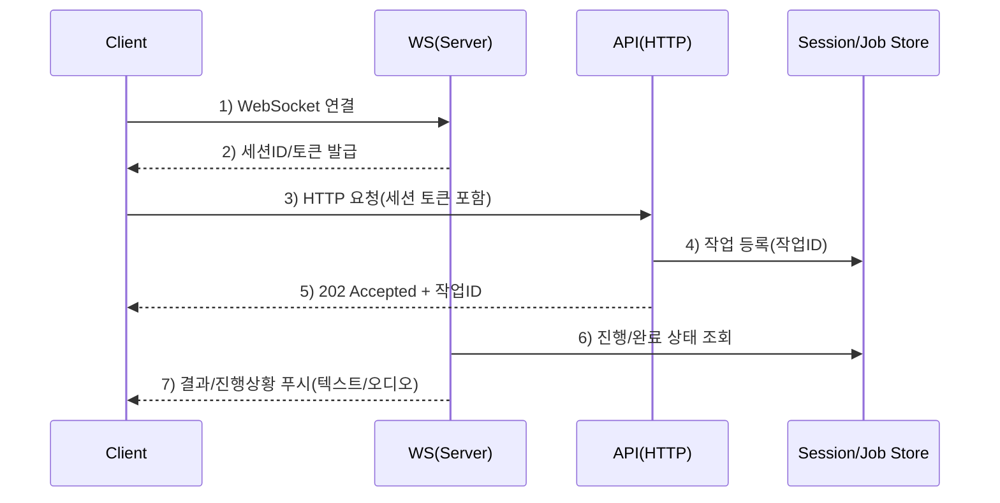
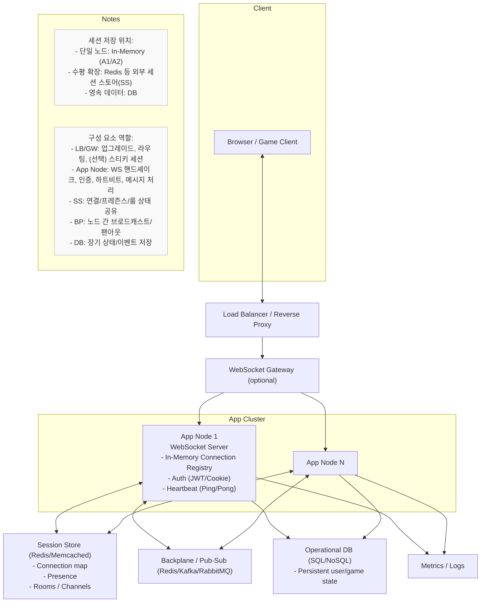

## 서버-클라이언트 동작 구조 및 아키텍처 평가

### 배경과 목표
- **핵심 목표**: 현재 서버와 클라이언트의 동작 구조를 정리하고, HTTP+WebSocket 혼합 아키텍처의 타당성을 평가한다.
- **요약**: 클라이언트는 최초 WebSocket 연결로 세션/토큰을 수립하고, 실제 서비스 요청은 HTTP로 전송한다. 서버는 요청을 수락(비동기 수행) 후 결과를 WebSocket으로 푸시한다.

## 현재 동작 구조

## 왜 HTTP + WebSocket인가
- **책임 분리**
  - **HTTP**: 인증/인가, 요청 검증, 수락(202), 아이템포턴시, 추적/로깅, 보안 프록시 호환
  - **WebSocket**: 양방향/저지연, 결과 푸시, 부분결과/오디오 등 스트리밍
- **운영 현실**: HTTP 생태계(프록시/캐시/모니터링)가 성숙, WS는 장기 연결·푸시에 최적
- **사용 사례 부합**: LLM/TTS/비동기 처리 + 실시간 결과 전송 요구 충족

## 대안 비교
- **HTTP Only**
  - 장점: 단순, 완전 Stateless, 인프라 친화적
  - 한계: 서버 푸시 어려움, 폴링/Long Polling/SSE로 보완 필요, 바이너리/양방향 제약
- **WebSocket Only**
  - 장점: 초저지연 양방향, 스트리밍 적합
  - 한계: 요청 수락/검증/아이템포턴시/관찰성 등을 자체 구현해야 함, 운영 복잡도↑
- **HTTP + SSE**
  - 장점: 단방향 텍스트 이벤트에 경제적, 구현 단순
  - 한계: 바이너리/양방향 불가, 대규모 팬아웃·제어 흐름에 제약
- **HTTP + WebSocket(현 구조)**
  - 장점: 요청 신뢰성(HTTP) + 실시간/스트리밍(WS) 결합
  - 비용: 세션/연결 관리, 재연결/라우팅 등 복잡성 존재

## 논의 쟁점 정리
### 1) HTTP Only를 포기함으로써의 Stateless 문제
- **평가**: HTTP 계층의 Stateless는 유지 가능. 연결 상태는 외부화한다.
- **보완책**:
  - `ISessionStorage`(예: Redis/In-Memory)로 `sessionId/userId/nodeId/lastSeen/ttl` 관리
  - 하트비트 기반 만료, 재시작 시 정합성 회복, `sessionId→nodeId` 라우팅 공유
  - 백플레인(pub/sub)로 노드 간 브로드캐스트/팬아웃

### 2) WebSocket Only를 포기하며 생기는 WS의 정체성 문제
- **평가**: 서버 푸시 전용으로 WS를 사용하는 것은 합리적. 요청 수락/검증은 HTTP가 적합
- **판단 기준**:
  - 텍스트 소량 알림이면 SSE 고려
  - 오디오/바이너리 스트리밍·부분 결과 스트리밍·저지연 요구가 있으면 WS 유지가 타당

## 세션 스토리지 설계와 역할
- **역할**: 런타임 소켓 핸들이 아닌, 공유 가능한 메타데이터의 단일 근원지
- **저장 정보 예시**: `sessionId`, `userId`, `nodeId`, `connectedAt`, `lastSeen`, `presence`, `rooms/channels`
- **수명주기**: 등록 → 하트비트 갱신 → 종료 시 삭제 → TTL로 유실 연결 정리
- **현재 구현(스켈레톤)**:
  - 인터페이스: `ProjectVG.Infrastructure.SessionStorage.ISessionStorage`
  - 구현체: `InMemorySessionStorage`, `RedisSessionStorage`(향후 구현 예정)

## 레포 적용 현황
- **의존성 교체**: `ISessionRepository → ISessionStorage`로 서비스 의존성 변경
- **DI 등록**: `Program.cs`에 `ISessionStorage -> InMemorySessionStorage` 등록
- **런타임 연결**: 노드 로컬 `ConcurrentDictionary<string, IClientConnection>`로 활성 연결 보관
- **팩토리 유지**: `IClientConnectionFactory`/`WebSocketClientConnection`은 전송/생성 책임 분리를 위해 유지

## 의사결정 요약
- **결정**
  - HTTP 수락 + WebSocket 결과 푸시 구조 유지
  - 세션 상태(메타데이터)는 `ISessionStorage`로 외부화
  - 런타임 전송은 `IClientConnection`(WebSocket 핸들)로 노드 로컬 관리
  - 추후 Redis 기반 스토리지/백플레인 도입으로 수평 확장 준비
- **배제/보류**
  - HTTP Only: 실시간/바이너리 스트리밍 요구로 부적합
  - WS Only: 운영 복잡도 및 HTTP 생태계 이점 상실로 비선호
  - HTTP+SSE: 바이너리/양방향 요구로 범위를 벗어남

## 운영 체크리스트
- Ping/Pong 주기·유휴 타임아웃·압축·버퍼 크기 최적화
- 재연결 전략: `operationId` 기반 미수신 결과 복구 또는 최종 상태 조회
- 보안: 세션 토큰과 사용자 토큰 바인딩, 만료/회수 정책, 노드 간 검증
- 관찰성: traceId/correlationId 전파, 활성 연결·전송량·지연·재연결율 메트릭 수집

## 아키텍처 개요 다이어그램

