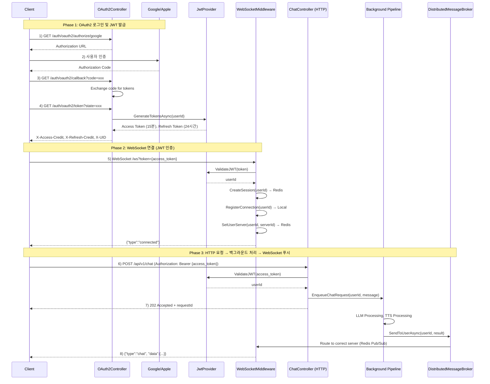
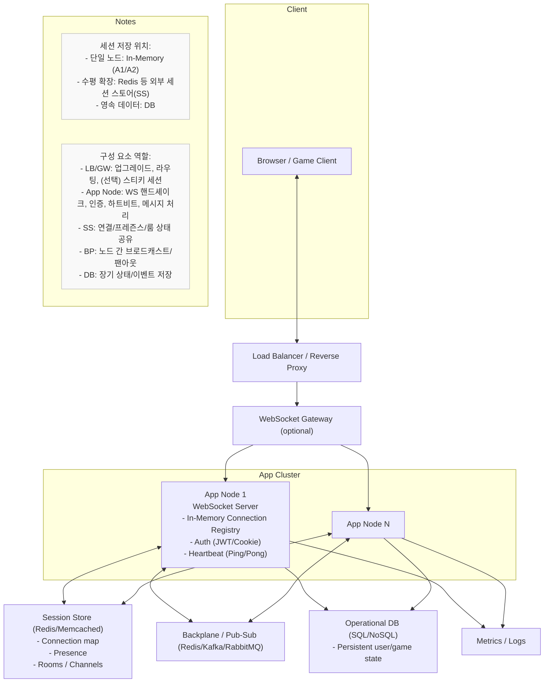

## 서버-클라이언트 동작 구조 및 아키텍처 평가

### 배경과 목표
- **핵심 목표**: 현재 서버와 클라이언트의 동작 구조를 정리하고, HTTP+WebSocket 혼합 아키텍처의 타당성을 평가한다.
- **요약**: 클라이언트는 OAuth2로 로그인하여 JWT를 발급받고, 이 JWT를 WebSocket 연결 및 HTTP API 요청에 모두 사용한다. 서버는 HTTP 요청을 수락(202 Accepted)하고 백그라운드 처리 후 결과를 WebSocket으로 푸시한다.

## 현재 동작 구조 (실제 구현)


```mermaid
sequenceDiagram
  participant Client
  participant OAuth as OAuth2Controller
  participant Provider as Google/Apple
  participant JWT as JwtProvider
  participant WS as WebSocketMiddleware
  participant API as ChatController (HTTP)
  participant Pipeline as Background Pipeline
  participant Broker as DistributedMessageBroker

  Note over Client,Provider: Phase 1: OAuth2 로그인 및 JWT 발급
  Client->>OAuth: 1) GET /auth/oauth2/authorize/google
  OAuth-->>Client: Authorization URL
  Client->>Provider: 2) 사용자 인증
  Provider-->>Client: Authorization Code
  Client->>OAuth: 3) GET /auth/oauth2/callback?code=xxx
  OAuth->>OAuth: Exchange code for tokens
  Client->>OAuth: 4) GET /auth/oauth2/token?state=xxx
  OAuth->>JWT: GenerateTokensAsync(userId)
  JWT-->>OAuth: Access Token (15분), Refresh Token (24시간)
  OAuth-->>Client: X-Access-Credit, X-Refresh-Credit, X-UID

  Note over Client,WS: Phase 2: WebSocket 연결 (JWT 인증)
  Client->>WS: 5) WebSocket /ws?token={access_token}
  WS->>JWT: ValidateJWT(token)
  JWT-->>WS: userId
  WS->>WS: CreateSession(userId) → Redis
  WS->>WS: RegisterConnection(userId) → Local
  WS->>WS: SetUserServer(userId, serverId) → Redis
  WS-->>Client: {"type":"connected"}

  Note over Client,Broker: Phase 3: HTTP 요청 → 백그라운드 처리 → WebSocket 푸시
  Client->>API: 6) POST /api/v1/chat (Authorization: Bearer {access_token})
  API->>JWT: ValidateJWT(access_token)
  JWT-->>API: userId
  API->>Pipeline: EnqueueChatRequest(userId, message)
  API-->>Client: 7) 202 Accepted + requestId

  Pipeline->>Pipeline: LLM Processing, TTS Processing
  Pipeline->>Broker: SendToUserAsync(userId, result)
  Broker->>WS: Route to correct server (Redis Pub/Sub)
  WS-->>Client: 8) {"type":"chat", "data":{...}}
```

## 왜 HTTP + WebSocket인가
- **책임 분리**
  - **HTTP**: 인증/인가, 요청 검증, 수락(202), 아이템포턴시, 추적/로깅, 보안 프록시 호환
  - **WebSocket**: 양방향/저지연, 결과 푸시, 부분결과/오디오 등 스트리밍
- **운영 현실**: HTTP 생태계(프록시/캐시/모니터링)가 성숙, WS는 장기 연결·푸시에 최적
- **사용 사례 부합**: LLM/TTS/비동기 처리 + 실시간 결과 전송 요구 충족

## 대안 비교
- **HTTP Only**
  - 장점: 단순, 완전 Stateless, 인프라 친화적
  - 한계: 서버 푸시 어려움, 폴링/Long Polling/SSE로 보완 필요, 바이너리/양방향 제약
- **WebSocket Only**
  - 장점: 초저지연 양방향, 스트리밍 적합
  - 한계: 요청 수락/검증/아이템포턴시/관찰성 등을 자체 구현해야 함, 운영 복잡도↑
- **HTTP + SSE**
  - 장점: 단방향 텍스트 이벤트에 경제적, 구현 단순
  - 한계: 바이너리/양방향 불가, 대규모 팬아웃·제어 흐름에 제약
- **HTTP + WebSocket(현 구조)**
  - 장점: 요청 신뢰성(HTTP) + 실시간/스트리밍(WS) 결합
  - 비용: 세션/연결 관리, 재연결/라우팅 등 복잡성 존재

## 논의 쟁점 정리
### 1) HTTP Only를 포기함으로써의 Stateless 문제
- **평가**: HTTP 계층의 Stateless는 유지 가능. 연결 상태는 외부화한다.
- **보완책**:
  - `ISessionStorage`(예: Redis/In-Memory)로 `sessionId/userId/nodeId/lastSeen/ttl` 관리
  - 하트비트 기반 만료, 재시작 시 정합성 회복, `sessionId→nodeId` 라우팅 공유
  - 백플레인(pub/sub)로 노드 간 브로드캐스트/팬아웃

### 2) WebSocket Only를 포기하며 생기는 WS의 정체성 문제
- **평가**: 서버 푸시 전용으로 WS를 사용하는 것은 합리적. 요청 수락/검증은 HTTP가 적합
- **판단 기준**:
  - 텍스트 소량 알림이면 SSE 고려
  - 오디오/바이너리 스트리밍·부분 결과 스트리밍·저지연 요구가 있으면 WS 유지가 타당

## OAuth2 인증 및 JWT 발급 (실제 구현)

### OAuth2 플로우
**구현 위치**: [ProjectVG.Api/Controllers/OAuthController.cs](../../ProjectVG.Api/Controllers/OAuthController.cs)

#### 1단계: Authorization URL 요청
```
GET /auth/oauth2/authorize/{provider}?state={state}&code_challenge={challenge}&code_challenge_method=S256
```
- **지원 Provider**: Google, Apple
- **PKCE 지원**: code_challenge, code_challenge_method (S256)
- **응답**: Provider별 Authorization URL

#### 2단계: OAuth2 Callback
```
GET /auth/oauth2/callback?code={code}&state={state}
```
- Provider에서 Authorization Code 수신
- 내부적으로 토큰 생성 및 임시 저장

#### 3단계: Token 교환
```
GET /auth/oauth2/token?state={state}
```
- **응답 헤더**:
  - `X-Access-Credit`: Access Token (JWT, 15분 만료)
  - `X-Refresh-Credit`: Refresh Token (JWT, 24시간 만료)
  - `X-Expires-In`: Access Token 만료 시간 (Unix timestamp)
  - `X-UID`: User ID (Guid)

### JWT 구조
**구현 위치**: [ProjectVG.Infrastructure/Auth/JwtProvider.cs](../../ProjectVG.Infrastructure/Auth/JwtProvider.cs)

#### Access Token (15분 만료)
```json
{
  "header": {
    "alg": "HS256",
    "typ": "JWT"
  },
  "payload": {
    "sub": "user-id-guid",
    "type": "access",
    "nbf": 1705315200,
    "exp": 1705316100,
    "iat": 1705315200,
    "iss": "ProjectVG",
    "aud": "ProjectVG-Client"
  }
}
```

#### Refresh Token (24시간 만료)
```json
{
  "header": {
    "alg": "HS256",
    "typ": "JWT"
  },
  "payload": {
    "sub": "user-id-guid",
    "type": "refresh",
    "nbf": 1705315200,
    "exp": 1705401600,
    "iat": 1705315200,
    "iss": "ProjectVG",
    "aud": "ProjectVG-Client"
  }
}
```

**핵심 특징**:
- **알고리즘**: HMAC SHA256
- **Claims**: `sub` (ClaimTypes.NameIdentifier) = userId
- **검증**: Issuer, Audience, Lifetime, Signing Key 모두 검증
- **Clock Skew**: 0 (정확한 만료 시간 적용)

### JWT 사용 방식

#### HTTP API 인증
**구현 위치**: [ProjectVG.Api/Filters/JwtAuthenticationFilter.cs](../../ProjectVG.Api/Filters/JwtAuthenticationFilter.cs)

```csharp
[HttpPost]
[JwtAuthentication]  // JWT 검증 필터
public async Task<IActionResult> ProcessChat([FromBody] ChatRequest request)
{
    // User.FindFirst(ClaimTypes.NameIdentifier)로 userId 추출
    var userId = User.FindFirst(ClaimTypes.NameIdentifier)?.Value;
    // ...
}
```

- **헤더**: `Authorization: Bearer {access_token}`
- **검증 시점**: 매 HTTP 요청마다
- **추출 정보**: userId (ClaimTypes.NameIdentifier)

#### WebSocket 인증
**구현 위치**: [ProjectVG.Api/Middleware/WebSocketMiddleware.cs](../../ProjectVG.Api/Middleware/WebSocketMiddleware.cs)

```csharp
// WebSocket 연결 시 JWT 검증 (1회만)
private Guid? ValidateAndExtractUserId(HttpContext context)
{
    var token = ExtractToken(context);  // Query string 또는 Authorization header
    var userIdString = _jwtProvider.GetUserIdFromToken(token);
    // ...
}
```

- **전달 방식**:
  1. Query Parameter: `/ws?token={access_token}` (권장)
  2. Authorization Header: `Authorization: Bearer {access_token}`
- **검증 시점**: WebSocket 연결 수립 시 1회
- **세션 유지**: JWT 검증 후 세션 생성, 이후 ping/pong으로 세션 TTL 갱신

**중요**: HTTP와 WebSocket에서 **동일한 JWT 토큰** 사용

## 세션 스토리지 설계와 역할 (실제 구현)

### 3-Tier 세션 관리 아키텍처

#### Tier 1: 로컬 연결 관리
- **구현**: [WebSocketConnectionManager](../../ProjectVG.Application/Services/Session/WebSocketConnectionManager.cs)
- **저장소**: `ConcurrentDictionary<string, IClientConnection>` (userId → connection)
- **범위**: 현재 서버 프로세스 내
- **목적**: 실제 WebSocket 송수신

#### Tier 2: Redis 세션 메타데이터
- **구현**: [RedisSessionManager](../../ProjectVG.Application/Services/Session/RedisSessionManager.cs), [RedisSessionStorage](../../ProjectVG.Infrastructure/Persistence/Session/RedisSessionStorage.cs)
- **Redis 키**: `session:user:{userId}`
- **TTL**: 30분 (ping으로 갱신)
- **저장 데이터**:
```json
{
  "SessionId": "user-guid",
  "UserId": "user-guid",
  "ConnectedAt": "2024-01-15T10:30:00Z",
  "LastActivity": "2024-01-15T10:45:00Z"
}
```

#### Tier 3: Redis 사용자-서버 매핑
- **구현**: [RedisServerRegistrationService](../../ProjectVG.Infrastructure/Services/Server/RedisServerRegistrationService.cs)
- **Redis 키**: `user:server:{userId}`
- **TTL**: 35분 (세션보다 5분 더 김)
- **저장 데이터**: serverId 문자열 (예: `api-server-hostname-12345-1705315200`)
- **목적**: 분산 환경에서 메시지 라우팅

### 수명주기
1. **등록**: WebSocket 연결 → JWT 검증 → 세션 생성 (3-Tier 모두 생성)
2. **하트비트**: 클라이언트 ping → Redis 세션 TTL 갱신 (30분)
3. **종료**: 연결 끊김 → 3-Tier 모두 정리 (로컬, Redis 세션, Redis 매핑)
4. **자동 정리**: TTL 만료 시 Redis 자동 삭제

## 레포 적용 현황 (실제 구현)
- **의존성 주입**:
  - `IWebSocketConnectionManager → WebSocketConnectionManager` (로컬 연결)
  - `ISessionManager → RedisSessionManager` (Redis 세션)
  - `IServerRegistrationService → RedisServerRegistrationService` (서버 등록)
  - `IMessageBroker → DistributedMessageBroker` (메시지 라우팅)
- **DI 등록**: [Program.cs](../../ProjectVG.Api/Program.cs)에서 모든 서비스 등록
- **런타임 연결**: `ConcurrentDictionary<string, IClientConnection>`로 활성 WebSocket 보관
- **WebSocket 구현**: [WebSocketClientConnection](../../ProjectVG.Infrastructure/Realtime/WebSocketConnection/WebSocketClientConnection.cs)에서 ArrayPool 최적화 적용

## 의사결정 요약

### 채택된 아키텍처
1. **HTTP 수락 + WebSocket 결과 푸시 구조**
   - HTTP: OAuth2 로그인, JWT 발급, API 요청 수락 (202 Accepted)
   - WebSocket: 실시간 결과 푸시, 양방향 통신, 바이너리 스트리밍
2. **3-Tier 세션 관리**
   - 로컬: WebSocketConnectionManager (ConcurrentDictionary)
   - Redis 세션: RedisSessionManager (session:user:{userId})
   - Redis 라우팅: ServerRegistrationService (user:server:{userId})
3. **OAuth2 + JWT 기반 인증**
   - OAuth2로 로그인, JWT 발급 (Access: 15분, Refresh: 24시간)
   - 동일한 JWT를 HTTP와 WebSocket 모두에서 사용
   - HTTP: 매 요청마다 검증 (JwtAuthenticationFilter)
   - WebSocket: 연결 시 1회 검증, 이후 세션 유지
4. **Redis Pub/Sub 기반 분산 메시지 라우팅** (구현 완료)
   - 로컬 연결 우선 (Redis 오버헤드 없음)
   - 원격 사용자: 서버 채널로 라우팅 (server:{serverId})
   - 서버 등록 및 자동 디스커버리

### 배제된 대안
- **HTTP Only**: 실시간/바이너리 스트리밍 요구로 부적합
- **WS Only**: 운영 복잡도 및 HTTP 생태계 이점 상실로 비선호
- **HTTP+SSE**: 바이너리/양방향 요구로 범위를 벗어남

## 운영 체크리스트

### 구현 완료
- ✅ **Ping/Pong 하트비트**: 30분 세션 타임아웃, ping으로 TTL 갱신
- ✅ **ArrayPool 최적화**: WebSocketClientConnection에서 LOH 할당 방지
- ✅ **서버 자동 등록**: 5분 TTL, 하트비트로 갱신, 장애 서버 자동 제거
- ✅ **로컬 우선 라우팅**: 같은 서버 메시지는 Redis 우회
- ✅ **Graceful Cleanup**: Finally 블록에서 모든 리소스 정리
- ✅ **JWT 보안**: HMAC SHA256, 만료 시간 검증, Zero clock skew
- ✅ **세션 보안**: JWT에서 추출한 userId로 세션 생성, 동시 접속 제한

### 향후 개선 사항
- ⏳ **재연결 전략**: requestId 기반 미수신 결과 복구 또는 최종 상태 조회
- ⏳ **압축**: WebSocket 메시지 압축 옵션
- ⏳ **관찰성**: traceId/correlationId 전파, 활성 연결·전송량·지연·재연결율 메트릭 수집
- ⏳ **Rate Limiting**: 사용자별/IP별 요청 제한

## 아키텍처 개요 다이어그램


```mermaid
graph TB
  subgraph "Client"
    C["Browser / Game Client"]
  end

  LB["Load Balancer / Reverse Proxy"]
  GW["WebSocket Gateway (optional)"]

  subgraph "App Cluster"
    A1["App Node 1\nWebSocket Server\n- In-Memory Connection Registry\n- Auth (JWT/Cookie)\n- Heartbeat (Ping/Pong)"]
    A2["App Node N"]
  end

  SS["Session Store (Redis/Memcached)\n- Connection map\n- Presence\n- Rooms / Channels"]
  BP["Backplane / Pub-Sub (Redis/Kafka/RabbitMQ)"]
  DB["Operational DB (SQL/NoSQL)\n- Persistent user/game state"]
  LOG["Metrics / Logs"]

  C <--> LB
  LB --> GW
  GW --> A1
  GW --> A2

  A1 <--> SS
  A2 <--> SS

  A1 <--> BP
  A2 <--> BP

  A1 --> DB
  A2 --> DB

  A1 --> LOG
  A2 --> LOG

  classDef note fill:#f9f9f9,stroke:#bbb,color:#333;

  subgraph "Notes"
    N1["세션 저장 위치:\n- 단일 노드: In-Memory (A1/A2)\n- 수평 확장: Redis 등 외부 세션 스토어(SS)\n- 영속 데이터: DB"]
    N2["구성 요소 역할:\n- LB/GW: 업그레이드, 라우팅, (선택) 스티키 세션\n- App Node: WS 핸드셰이크, 인증, 하트비트, 메시지 처리\n- SS: 연결/프레즌스/룸 상태 공유\n- BP: 노드 간 브로드캐스트/팬아웃\n- DB: 장기 상태/이벤트 저장"]
  end

  class N1,N2 note;
```


